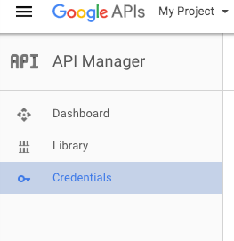

This is about as basic as you can get to set up the googe authentication with passportjs.

I have created a database using SQL to hold the user info, you can find the schema in the db folder.

You will need to create credentials at console.developers.google.com and insert them into you config folder.

1. Click on credentials
    
2. Click "Create credentials
    
3. Click OAuth client ID
4. Fill out the information. You can use localhost:{your port here} until your site is hosted
    

Once you are done with that, you will be able to see your client id and client secret.

Save those into your config.js file.

